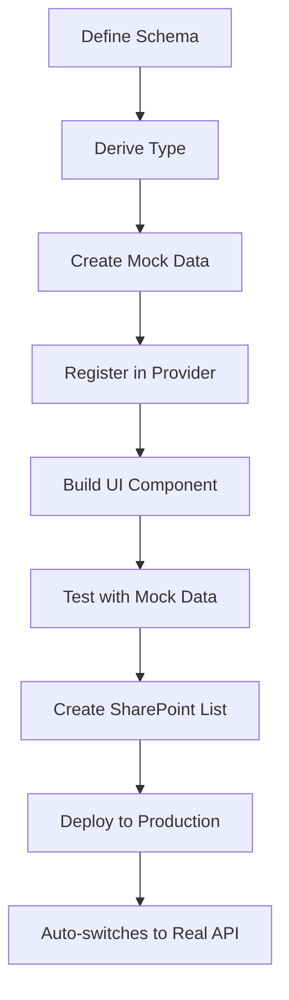

# Core Concepts

Understanding the fundamental patterns that power this starter.

---

## Data Layer Architecture

The data layer follows a **provider pattern** that abstracts data operations:

```
UI Component
    ↓
Data Provider Interface (getListItems, postListItem, etc.)
    ↓
    ├─→ MockDataProvider (localhost) → Local mock data
    └─→ SharePointDataProvider (production) → REST API
```

**Key insight:** Your components never know where data comes from - the provider handles it.

### How It Works

```typescript
// In your component
import { getDataProvider } from "$lib/data/data-providers/provider-factory";

const provider = getDataProvider(); // Auto-selects mock or real

const response = await provider.getListItems({
  listName: "Stories",
  signal,
});
```

**Benefits:**

- ✅ No `if (LOCAL_MODE)` conditionals in UI code
- ✅ Easy to test with mocks
- ✅ Seamless dev/prod switching
- ✅ Type-safe operations

See [Architecture docs](/docs/architecture) for detailed implementation.

---

## Schemas → Types → Validation

The starter uses **Zod schemas** as the single source of truth:

### 1. Define Schema (Source of Truth)

[src/lib/data/schemas.ts](../../src/lib/data/schemas.ts):

```typescript
import { z } from "zod";
import { Sharepoint_Default_Props_Schema, Sharepoint_Lookup_DefaultProps_Schema } from "$lib/common-library/integrations";

export const StorySchema = z.strictObject({
  ...Sharepoint_Default_Props_Schema.shape, // Id, Created, Modified, etc.
  Title: z.string().min(3, "Title must be at least 3 characters"),
  Content: z.string(),
  Tags: z.string(),
  Author: Sharepoint_Lookup_DefaultProps_Schema,
  Status: z.enum(["Draft", "Published", "Archived"]),
});

export const StoryPostSchema = z.strictObject({
  Title: z.string().min(3),
  Content: z.string().min(10, "Content too short"),
  Tags: z.string(),
  Status: z.enum(["Draft", "Published", "Archived"]),
});
```

**Schema Components:**

- `Sharepoint_Default_Props_Schema` - SharePoint system fields (Id, Created, Modified, Author metadata, etc.)
- `Sharepoint_Lookup_DefaultProps_Schema` - LookUp column structure `{ Id, Title }`
- `z.strictObject()` - Catches typos by disallowing extra properties

### 2. Derive TypeScript Types

[src/lib/data/types.ts](../../src/lib/data/types.ts):

```typescript
import type z from "zod";
import { StorySchema, StoryPostSchema } from "./schemas";

export type Story_ListItem = z.infer<typeof StorySchema>;
export type Story_ListItem_Post = z.infer<typeof StoryPostSchema>;
```

**No manual typing!** Types are automatically derived from schemas.

### 3. Validation Happens Automatically

```typescript
// Runtime validation in data providers
const validated = StorySchema.parse(responseData);

// If validation fails, you get detailed error:
// "Title must be at least 3 characters"
```

### Schema Best Practices

**DO:**

- ✅ Use `z.strictObject()` to catch extra/missing properties
- ✅ Add validation messages: `z.string().min(3, "Too short")`
- ✅ Extend `Sharepoint_Default_Props_Schema` for list items
- ✅ Use `Sharepoint_Lookup_DefaultProps_Schema` for LookUp columns
- ✅ Keep Post schemas separate (no Id, Created, Modified)
- ✅ Use `ColumnNameId` for LookUp references in Post schemas

**DON'T:**

- ❌ Manually write TypeScript interfaces
- ❌ Skip validation messages
- ❌ Use `z.object()` instead of `z.strictObject()`
- ❌ Forget to expand LookUp columns when fetching

---

## SharePoint Default Properties

Every SharePoint list item includes these system fields:

```typescript
export const Sharepoint_Default_Props_Schema = z.strictObject({
  Id: z.number(),
  Created: z.string(), // ISO 8601 date string
  Modified: z.string(),
  // ... other system fields
});
```

**Always include these** when defining list item schemas:

```typescript
export const MyListSchema = z.strictObject({
  ...Sharepoint_Default_Props_Schema.shape, // ← Include this
  Title: z.string(),
  // Your custom fields
});
```

---

## LookUp Columns

SharePoint LookUp columns reference other lists. Handle them carefully:

### Schema Definition

```typescript
export const StorySchema = z.strictObject({
  ...Sharepoint_Default_Props_Schema.shape,
  Title: z.string(),
  Author: Sharepoint_Lookup_DefaultProps_Schema, // { Id, Title }
  Category: Sharepoint_Lookup_DefaultProps_Schema.optional(),
});

export const StoryPostSchema = z.strictObject({
  Title: z.string(),
  AuthorId: z.number(), // Use "Id" suffix for LookUp reference
  CategoryId: z.number().optional(),
});
```

### Fetching with LookUp Columns

**Must use `expand`** to get LookUp data:

```typescript
const response = await provider.getListItems({
  listName: "Stories",
  operations: [
    ["select", "Id,Title,Author/Id,Author/Title,Category/Id,Category/Title"],
    ["expand", "Author,Category"], // ← Required!
  ],
});
```

**Response format:**

```json
{
  "Id": 1,
  "Title": "My Story",
  "Author": { "Id": 5, "Title": "John Doe" },
  "Category": { "Id": 2, "Title": "News" }
}
```

### Creating Items with LookUp References

```typescript
const newStory = {
  Title: "New Story",
  AuthorId: 5, // Reference by Id
  CategoryId: 2,
};

await provider.postListItem({
  listName: "Stories",
  body: newStory,
});
```

**Remember:** Query uses `Author/Title`, Post uses `AuthorId`.

---

## State Management

### Global State

Centralized app state using Svelte 5 runes:

[src/lib/data/global-state.svelte.ts](../../src/lib/data/global-state.svelte.ts):

```typescript
export const global_State = $state({
  currentUser: undefined,
  userProperties: undefined,
  accessRole: null,
});

// Setter functions with validation
export function setCurrentUser(user: Sharepoint_User | undefined) {
  if (user && (!user.Id || !user.LoginName)) {
    console.warn("Invalid user data");
    return;
  }
  global_State.currentUser = user;
}

// Derived state
export const isAdmin = $derived(global_State.accessRole === "Admin");

export const currentUserId = $derived(global_State.currentUser?.Id);

// Computed helper
export function canEditItem(authorId: number | undefined): boolean {
  return global_State.accessRole === "Admin" || global_State.currentUser?.Id === authorId;
}
```

**Usage in components:**

```svelte
<script>
  import { global_State, isAdmin, canEditItem } from "$lib/data/global-state.svelte";

  const userCanEdit = $derived(canEditItem(story?.Author?.Id));
</script>

{#if isAdmin}
  <AdminPanel />
{/if}

{#if userCanEdit}
  <button>Edit</button>
{/if}
```

### Async State for Loading

Track loading/error states:

```typescript
import { SharePointAsyncLoadState } from "$lib/common-library/integrations";

const loadState = new SharePointAsyncLoadState();

async function loadData() {
  loadState.setLoading();
  try {
    const data = await provider.getListItems({ listName: "Stories" });
    items = data.value;
    loadState.setReady();
  } catch (err) {
    loadState.setError(err.message, "DataLoad"); // Auto-reports to SharePoint
  }
}
```

**In template:**

```svelte
{#if loadState.loading}
  <LoadingSpinner />
{:else if loadState.error}
  <ErrorMessage message={loadState.error} />
{:else if loadState.ready}
  <DataDisplay {items} />
{/if}
```

See [State Management](/docs/state) for detailed patterns.

---

## Routing

Uses **hash-based routing** (works on SharePoint without server config):

### Basic Navigation

```typescript
import { navigate, p } from "sv-router/generated";

// Navigate to a route
navigate("/stories");
navigate("/stories/123");

// With query params
navigate("/stories", {
  replace: true,
  queryParams: { filter: "active" },
});

// Get path helper (for links)
const storyPath = p("/stories/:id", { id: "123" });
// Returns: "#/stories/123"
```

### Route Parameters

```svelte
<script>
  import { route } from "sv-router/generated";

  const params = $derived(route.getParams("/stories/:id"));
  const storyId = $derived(params.id);

  $effect(() => {
    loadStory(storyId);
  });
</script>
```

### Route Layout

```svelte
<!-- routes/stories/layout.svelte -->
<script lang="ts">
  import type { Snippet } from "svelte";
  let { children }: { children: Snippet } = $props();
</script>

<div class="stories-layout">
  <StoriesHeader />
  {@render children()}
  <StoriesFooter />
</div>
```

**Route structure:**

```
routes/
├── index.svelte          # /
├── layout.svelte         # Root layout
├── stories/
│   ├── index.svelte      # /stories
│   ├── layout.svelte     # Stories layout
│   └── [id]/
│       └── index.svelte  # /stories/:id
```

---

## Asset Paths

**Always use relative paths** starting with `./assets`:

```svelte
<!-- ✅ CORRECT -->

<video src="./assets/videos/demo.mp4" />
<a href="./assets/docs/guide.pdf">Download</a>

<!-- ❌ WRONG -->


```

**Why?** SharePoint deployment structure:

```
SharePoint Document Library/
├── index.html          ← Your built app
└── assets/             ← Colocated static files
    ├── images/
    ├── videos/
    └── docs/
```

The built `index.html` and `assets/` are at the same level, so use relative paths.

---

## odata=nometadata Response Format

All SharePoint REST API responses use `odata=nometadata` format:

**Request:**

```javascript
headers: {
  "Accept": "application/json;odata=nometadata",
}
```

**Response (simplified):**

```json
{
  "value": [
    {
      "Id": 1,
      "Title": "Story Title",
      "Author": { "Id": 5, "Title": "John Doe" },
      "Created": "2025-01-01T10:00:00Z"
    }
  ]
}
```

**Benefits:**

- ✅ Smaller response size
- ✅ No metadata clutter
- ✅ Cleaner JSON structure
- ✅ Easier to parse

**Note:** No `__metadata` property in responses when using this format.

---

## Mock Data Structure

Mock data must match SharePoint response format exactly:

```typescript
export const LOCAL_STORY_ITEMS: Story_ListItem[] = [
  {
    Id: 1,
    Title: "Sample Story",
    Content: "Story content...",
    Tags: "tech,innovation",
    Author: { Id: 1, Title: "John Doe" }, // LookUp format
    Status: "Published",
    Created: "2025-01-01T10:00:00Z", // ISO 8601
    Modified: "2025-01-05T15:30:00Z",
    // ... other SharePoint default props
  },
];
```

**Mock Data Checklist:**

- ✅ Includes all SharePoint default props
- ✅ LookUp columns use `{ Id, Title }` format
- ✅ Dates in ISO 8601 format
- ✅ Matches schema exactly
- ✅ Covers edge cases (empty strings, nulls, long text)

---

## Provider Factory Pattern

Automatic switching between mock and real data:

```typescript
// src/lib/data/data-providers/provider-factory.ts
import { LOCAL_MODE } from "$lib/common-library/utils/local-dev/modes";
import { MockDataProvider } from "./mock-data-provider";
import { SharePointDataProvider } from "$lib/common-library/integrations";

export function getDataProvider(): DataProvider {
  if (LOCAL_MODE) {
    return new MockDataProvider();
  }
  return new SharePointDataProvider();
}
```

**Usage everywhere:**

```typescript
const provider = getDataProvider(); // Works in dev & prod!
```

**No conditional logic needed** in your components.

---

## Common-Library vs App Layer

### Common-Library (`src/lib/common-library/`)

**Reusable across projects:**

- SharePoint REST API functions
- Data provider interfaces & base classes
- Error handling & analytics
- Router implementation
- Utility functions

**Rules:**

- ❌ Never imports from app layer
- ✅ Receives config via context/constructor
- ✅ Generic implementations
- ✅ Can be extracted to npm package

### App Layer (`src/lib/data/`, `src/lib/env/`, `src/routes/`)

**Project-specific:**

- Your schemas & types
- Mock data for your lists
- Concrete provider implementations
- App configuration
- Route pages

**Rules:**

- ✅ Imports from common-library
- ✅ Project-specific implementation
- ✅ Extends base classes from common-library

**Example:**

```typescript
// ❌ WRONG: common-library imports from app
import { SHAREPOINT_CONFIG } from "$lib/env/sharepoint-config"; // Can't do this in common-library

// ✅ RIGHT: app extends common-library
import { BaseMockDataProvider } from "$lib/common-library/integrations";
export class MockDataProvider extends BaseMockDataProvider {
  // App-specific implementation
}
```

---

## Type Safety Layers

Multiple layers ensure type safety:

### 1. Compile-Time (TypeScript)

```typescript
const story: Story_ListItem = {
  Title: "Test", // TypeScript error if wrong type
};
```

### 2. Runtime (Zod Validation)

```typescript
const validated = StorySchema.parse(data);
// Throws if data doesn't match schema
```

### 3. Config Validation (Startup)

```typescript
// Validates SHAREPOINT_CONFIG on app startup
// Catches misconfigurations immediately
```

### 4. Mock Data Sync

```typescript
// TypeScript enforces mock data has all lists
type MockDataMap = Record<ListNames, any[]>;
// Compile error if missing a list!
```

**Result:** Errors caught early, not in production!

---

## Development Flow



1. **Schema first** - Define in `schemas.ts`
2. **Types auto-derived** - Update `types.ts`
3. **Mock data** - Add to `local-data.ts`
4. **Provider registration** - Update `mock-data-provider.ts`
5. **Build UI** - Use `getDataProvider()`
6. **Test locally** - With mock data
7. **SharePoint setup** - Create lists
8. **Deploy** - Auto-switches to real API

---

## Next Topics

- **[SharePoint Integration](/docs/sharepoint)** - REST API patterns, limits, best practices
- **[State Management](/docs/state)** - Async operations, forms, global state
- **[Error Handling](/docs/errors)** - Error boundaries, reporting
- **[Examples](/docs/examples)** - See it all working together

---

## Quick Reference

| Concept      | File Location                         |
| ------------ | ------------------------------------- |
| Schemas      | `src/lib/data/schemas.ts`             |
| Types        | `src/lib/data/types.ts`               |
| Mock Data    | `src/lib/data/local-data.ts`          |
| Provider     | `src/lib/data/data-providers/`        |
| Config       | `src/lib/env/sharepoint-config.ts`    |
| Global State | `src/lib/data/global-state.svelte.ts` |
| Routes       | `src/routes/`                         |
